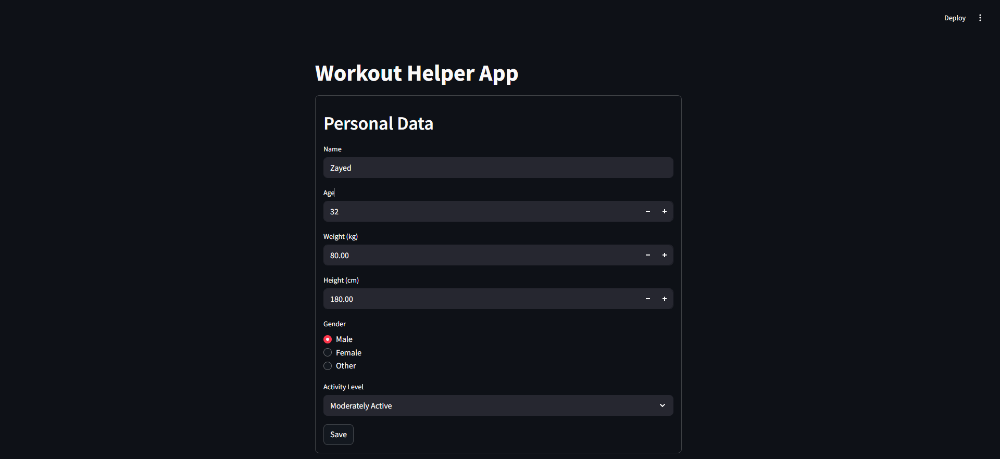
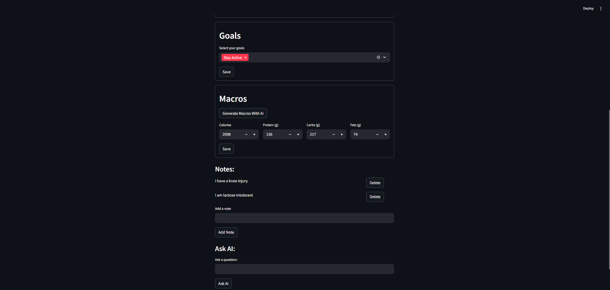
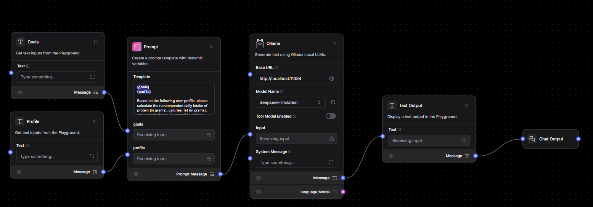
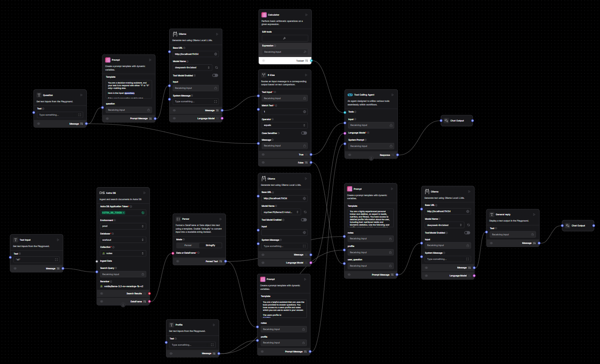

# 🧠 Multi-Agent AI Fitness Companion

A next-generation AI-powered fitness and nutrition assistant built with **Streamlit**, **Langflow**, and **AstraDB**. This project leverages **multiple intelligent agents** and **Retrieval-Augmented Generation (RAG)** to deliver personalized workout plans, macro calculations, and real-time fitness guidance—all in a sleek, interactive web app.

---

## 🚀 Key Features

### 🤖 Multi-Agent AI
Multiple specialized AI agents (powered by **Langflow** and **GPT-4**) collaborate to:
- Answer fitness/nutrition questions
- Generate daily macros
- Provide personalized recommendations

### 📋 Personal Profile Management
Securely store and update your:
- Name, Age, Gender
- Weight, Height
- Activity Level

### 🎯 Goal Setting
Set and track fitness objectives:
- Muscle Gain  
- Fat Loss  
- Stay Active  

### 🧮 AI Macro Calculator
Accurately compute:
- Daily Calories  
- Protein, Fats, Carbs  
- Personalized based on profile and goals.

### 📝 Notes & RAG
- Add, view, and delete personal notes  
- Notes are used in AI prompts via **RAG** for context-aware suggestions

### 💾 AstraDB Integration
Robust cloud-native DB with:
- Vector & document storage
- Scalability & security built-in

### ⚡ Streamlit UI
Responsive and interactive user interface with:
- Fast performance  
- Seamless UX  

---

## 🖼️ Screenshots

### 🧾 Personal Data Form
  
*User-friendly form to input and update personal information like age, weight, height, and activity level.*

---

### 📝 Other Forms (Macro Calculator & Notes)
  
*Interactive interface for generating daily macros and managing fitness/nutrition-related notes.*

---

### 🔄 Macro Flow (Langflow)
  
*Visual representation of the Langflow agent responsible for calculating personalized macros.*

---

### 💬 AskAI Flow (Langflow)
  
*Flow design for the conversational AI agent that answers user questions with context-aware insights.*

---

## 🎬 Demo

▶️ **[Watch the Demo Video](https://drive.google.com/file/d/17LxWgcYhWtinDiOtr3ql-bl94SquUjzb/view?usp=share_link)**  


---

## 🛠️ Tech Stack

| Tech        | Description                                           |
|-------------|-------------------------------------------------------|
| 🟣 Streamlit | Rapid, interactive web UI                            |
| 🧠 Langflow  | Visual AI agent orchestration (flows)                |
| 🌐 AstraDB   | Cloud DB with vector and document support            |
| 🐍 Python    | Core application logic                               |
| 🤖 GPT-4     | Advanced LLM for natural language reasoning          |
| 🔍 RAG       | Retrieval-Augmented Generation for contextual replies |

---

## 📁 Project Structure

```
├── __init__.py
├── .env
├── .gitignore
├── ai.py
├── db.py
├── env.sample
├── form_submit.py
├── main.py
├── notes.txt
├── profiles.py
├── requirements.txt
├── flows/
│   ├── AskAIV2.json
│   └── Macro Flow.json
├── prompts/
│   ├── conditional_router.txt
│   ├── general_agent.txt
│   ├── macro.txt
│   └── tool_calling_agent.txt
└── screenshots/
    ├── AskAIFlow.png
    ├── MacroFlow.png
    ├── UI_Other_Forms.png
    ├── UI_Personal_Data_Form.png
```

---

## 🔧 Setup Instructions

### 1. Clone the Repository

```bash
git clone https://github.com/Ajaymahdoriya/Multi_Agent_App.git
cd Multi_Agent_App
```

### 2. Install Dependencies
```bash
pip install -r requirements.txt
```

### 3. Configure Environment
Create a file called constants.py and add your Astra DB credentials:
```
Copy .env.sample to .env and fill in your AstraDB and Langflow credentials.

```

### 4. Run the App
```
streamlit run main.py
```

---

## 📌 Usage

- Enter personal data and fitness goals  
- Use AI to generate daily macros  
- Add and manage personal fitness notes  
- Ask any fitness/nutrition questions  
- Data is securely stored and can be updated anytime  

---

## 💡 Developer Notes

- Notes are stored as **vector-ready documents** for future RAG enhancements  
- **Langflow** can be swapped with other LLM providers  
- **AstraDB** handles scaling, indexing, and security  
- Modular codebase supports easy customization and extension  
